# faust-ddsp

DDSP experiments in Faust.

- [What is DDSP?](#what-is-ddsp)
- [DDSP in Faust](#ddsp-in-faust)
- [The `diff` library](#the-diff-library)
  - [The Autodiff Environment](#the-autodiff-environment)
  - [Differentiable Primitives](#differentiable-primitives)
    - [Number Primitive](#number-primitive)
    - [Identity Function](#identity-function)
    - [Add Primitive](#add-primitive)
    - [Subtract Primitive](#subtract-primitive)
    - [Multiply Primitive](#multiply-primitive)
    - [Divide Primitive](#divide-primitive)
    - [Power Primitive](#power-primitive)
    - [`int` Primitive](#int-primitive)
    - [`mem` Primitive](#mem-primitive)
    - [`@` Primitive](#primitive)
    - [`sin` Primitive](#sin-primitive)
    - [`cos` Primitive](#cos-primitive)
    - [`tan` Primitive](#tan-primitive)
  - [Helper Functions](#helper-functions)
    - [Input Primitive](#input-primitive)
    - [Differentiable Recursion](#differentiable-recursive-composition)
    - [Differentiable Phasor](#differentiable-phasor)
    - [Differentiable Oscillator](#differentiable-oscillator)
    - [Differentiable `sum` iteration](#differentiable-sum-iteration)
    - [Backpropagation Circuit](#backpropagation-circuit)
  - [Loss Functions](#loss-functions)
    - [L1 time-domain](#l1-time-domain)
    - [L2 time-domain](#l2-time-domain)
- [Roadmap](#roadmap)

## What is DDSP?

Differentiable programming is a technique whereby a program can be
differentiated with respect to its inputs, permitting the computation of the
sensitivity of the program's outputs to changes in its inputs.
Partial derivatives of a program can be found analytically via
[automatic differentiation](https://en.wikipedia.org/wiki/Automatic_differentiation)
and, coupled with an appropriate loss function, used to perform gradient
descent.
Differentiable programming has consequently become a key tool in solving machine
learning problems.

**Differentiable digital signal processing**
([DDSP](https://intro2ddsp.github.io/background/what-is-ddsp.html)) is the
specific application of differentiable programming to audio tasks.
DDSP has emerged as a key component in machine learning approaches to
problems such as source separation, timbre transfer, parameter estimation, etc.
DDSP is reliant on a programming language with a supporting framework for
automatic differentiation.

## DDSP in Faust

> Trigger warning: some mild-to-moderate calculus will follow

To write automatically differentiable code we need analytic expressions for the
derivatives of the primitive operations in our program.

### A Differentiable Primitive

Let's consider the example of the addition primitive; in Faust one can write:

```faust
process = +;
```

which yields the block diagram:


So, the output signal, the result of Faust's `process`, which we'll call $y$, is
the sum of two input signals, $u$ and $v$:

$$
y = u + v.
$$

Note that the addition primitive doesn't *know* anything about its arguments,
their origin, provenance, etc., it just consumes them and returns their sum.
In Faust's *algebra*, the addition of two signals (and just about *everything*
in Faust is a signal) is well-defined, and that's that.
This idea will be important later.

Now, say $y$ is dependent on some variable $x$, and we wish to know how
sensitive $y$ is to changes in $x$, then we should differentiate $y$ with
respect to $x$:

$$
\frac{dy}{dx} = \frac{d}{dx}\left(u + v\right) = \frac{du}{dx} + \frac{dv}{dx}.
$$

It happens that the derivative of an addition is also an addition, except this
time an addition of the derivatives of the arguments with respect to the
variable of interest.

In Faust, we could express this fact as follows:

```faust
process = +,+;
```

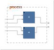

If we did, we'd be describing, in parallel, $y$ and $\frac{dy}{dx}$, which we
could write as:

$$
\begin{align*}
\langle y, \frac{dy}{dx} \rangle
&= \langle u, \frac{du}{dx} \rangle + \langle v, \frac{dv}{dx} \rangle \\
&= \langle u + v, \frac{du}{dx} + \frac{dv}{dx} \rangle.
\end{align*}
$$

This is a [*dual number*](https://en.wikipedia.org/wiki/Dual_number)
representation, or more accurately, since we're working with Faust, a *dual
signal* representation.
Being able to pass around our algorithm and its derivative in parallel, as dual
signals, is pretty handy, as we'll see later.
Anyway, what we've just defined is a *differentiable addition primitive*.

### But where exactly is the derivative?

Just as the addition primitive has no knowledge of its input signals, nor does
its differentiable counterpart.
The differentiable primitive promises the following: "give me $u$ and $v$, and
$\frac{du}{dx}$ and $\frac{dv}{dx}$ in that order, and I'll give you $y$ and
$\frac{dy}{dx}$".
So let's do just that.
For $u$ we'll use an arbitrary input signal, which we can represent with a wire,
`_`.
$x$ is the variable of interest; Faust's analogy to a variable is a slider[^1];
we'll create one and assign it to $v$.
$u$ and $x$ have no direct relationship, so $\frac{du}{dx}$ is $0$.
$v$ *is* $x$, so $\frac{dv}{dx}$ is $1$.

[^1]: This serves well enough for the example at hand, but in practice &mdash;
in a machine learning implementation &mdash; a *learnable parameter* is more
like a bargraph. We'll get to that [later](#gradient-descent).

```faust
x = hslider("x", 0, -1, 1, .1);
u = _;
v = x;
dudx = 0;
dvdx = 1;
process = u,v,dudx,dvdx : +,+;
```

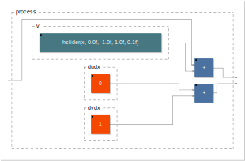

The first output of this program is the result of an expression describing an
input signal with a DC offset $x$ applied;
the second output is the derivative of that expression, a constant signal of
value $1$.
So far so good, but it's not very *automatic*.

### More Differentiable Primitives

We can generalise things a bit by defining a *differentiable input*[^2] and a
*differentiable slider*:

[^2]: An input isn't strictly a Faust primitive.
In fact, syntactically, what we're calling an *input* here is indistinguishable
from Faust's identity function, or *wire* (`_`), the derivative of which is also
a wire.
We need a distinct expression, however, for an arbitrary signal &mdash; mic
input, a soundfile, etc. &mdash; we know to be entering our program *from
outside*, as it were, and for which we have, in principle, no analytic
description.

```faust
diffInput = _,0;
diffSlider = hslider("x", 0, -1, 1, .1),1;
```

Simply applying the differentiable addition primitive to these new primitives
isn't going to work because inputs to the adder won't arrive in the correct
order;
we can fix this with a bit of routing however:

```faust
diffAdd = route(4,4,(1,1),(2,3),(3,2),(4,4)) : +,+;
```

Now we can write:

```faust
process = diffInput,diffSlider : diffAdd;
```

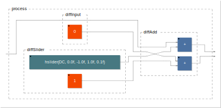

The outputs of our program are the same as before, but we've computed the
derivative *automatically* &mdash; to be precise, we've implemented *forward
mode automatic differentiation*.
Now we have the makings of a modular approach to automatic differentiation based
on differentiable primitives and dual signals.

### Multivariate Problems

The above works fine for a single variable, but what if our program has more
than one variable?
Consider the following non-differentiable example featuring a gain control and
a DC offset:

```faust
x1 = hslider("gain", .5, 0, 1, .1);
x2 = hslider("dc", 0, -1, 1, .1);
process = _,x1 : *,x2 : +;
```


We can write this as:

$$
y = uv + w, \quad v = x_1, \quad w = x_2.
$$

$u$ will again be an arbitrary input signal, for which we have no analytic
expression.

Now, rather than being a lone ordinary derivative $\frac{dy}{dx}$, the
derivative of $y$ &mdash; $y'$ &mdash; is a matrix of *partial derivatives*:

$$
y' = \frac{\partial y}{\partial \mathbf{x}}
= \begin{bmatrix}\frac{\partial y}{\partial x_1} \\
\frac{\partial y}{\partial x_2}\end{bmatrix}.
$$

Our algorithm takes two parameter inputs, and produces one output signal, so the
resulting *Jacobian* matrix is of dimension $2 \times 1$.

Returning to dual number representation and applying the chain and product rules
of differentiation, we have:

$$
\begin{align*}
\langle y,y' \rangle &=
\langle u,u' \rangle \langle v,v' \rangle + \langle w,w' \rangle \\
&= \langle uv,u'v + v'u \rangle + \langle w,w' \rangle \\
&= \langle uv + w,u'v + v'u + w'\rangle,
\end{align*}
$$

To implement the above in Faust, let's define some multivariate differentiable
primitives:

```faust
diffInput(nvars) = _,par(i,nvars,0);

diffSlider(nvars,I,init,lo,hi,step) = hslider("x%I",init,lo,hi,step),par(i,nvars,i==I-1);

diffAdd(nvars) = route(nIN,nOUT,
        (u,1),(v,2), // u + v
        par(i,nvars,
            (u+i+1,dx),(v+i+1,dx+1) // du/dx_i + dv/dx_i
            with {
                dx = 2*i+3; // Start of derivatives wrt ith var
            }
        )
    ) with {
        nIN = 2+2*nvars;
        nOUT = nIN;
        u = 1;
        v = u+nvars+1;
    } : +,par(i, nvars, +);

diffMul(nvars) = route(nIN,nOUT,
        (u,1),(v,2), // u * v
        par(i,nvars,
            (u,dx),(dvdx,dx+1),   // u * dv/dx_i
            (dudx,dx+2),(v,dx+3)  // du/dx_i * v
            with {
                dx = 4*i+3; // Start of derivatives wrt ith var
                dudx = u+i+1;
                dvdx = v+i+1;
            }
        )
    ) with {
        nIN = 2+2*nvars;
        nOUT = 2+4*nvars;
        u = 1;
        v = u+nvars+1;
    } : *,par(i, nvars, *,* : +);
```

The routing for `diffAdd` and `diffMul` is a bit more involved, but the same
principle applies as for the univariate differentiable addition primitive.
Our dual signal representation now consists, for each primitive, of the
undifferentiated primitive, and, in parallel, `nvars` partial derivatives, each
with respect to the $i^\text{th}$ variable of interest.
Accordingly, the differentiable slider now needs to know which value of $i$ to
take to ensure that the appropriate combination of partial derivatives can be
generated.

Armed with the above we can write the differentiable equivalent of our gain+DC
example:

```faust
NVARS = 2;
x1 = diffSlider(NVARS,1,.5,0,1,.1);
x2 = diffSlider(NVARS,2,0,-1,1,.1);
process = diffInput(NVARS),x1 : diffMul(NVARS),x2 : diffAdd(NVARS);
```

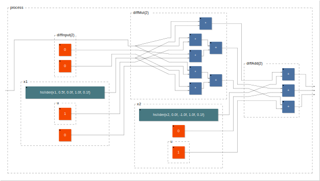

### Estimating Hidden Parameters

Assigning the above algorithm to a variable `estimate`, we can compare its
first output, $y$, with target output, $\hat{y}$, produced by a `groundTruth`
algorithm with hard-coded gain and DC values.
We'll use Faust's default sine wave oscillator as input to both algorithms,
and, to perform the comparison, we'll use a time-domain L1-norm loss function:

$$
\mathcal{L}(y,\hat{y}) = ||y-\hat{y}||
$$

```faust
import("stdfaust.lib"); // For os.osc, si.bus, etc.
process = os.osc(440.) <: groundTruth,estimate : loss,si.bus(NVARS)
with {
    groundTruth = _,.5 : *,-.5 : +;

    NVARS = 2;
    x1 = diffSlider(NVARS,1,1,0,1,.1);
    x2 = diffSlider(NVARS,2,0,-1,1,.1);
    estimate = diffInput(NVARS),x1 : diffMul(NVARS),x2 : diffAdd(NVARS);

    loss = ro.cross(2) : - : abs <: attach(hbargraph("loss",0,2));
};
```

Running this in the
[Faust web IDE](https://faustide.grame.fr/?autorun=1&voices=0&name=gain_dc_estimate&inline=aW1wb3J0KCJzdGRmYXVzdC5saWIiKTsKCmRlY2xhcmUgbmFtZSAiRGlmZmVyZW50aWFibGUgZ2FpbitEQyI7CgpkaWZmSW5wdXQobnZhcnMpID0gXyxwYXIobixudmFycywwKTsKCmRpZmZTbGlkZXIobnZhcnMsSSxpbml0LGxvLGhpLHN0ZXApID0gaHNsaWRlcigieCVJIixpbml0LGxvLGhpLHN0ZXApLHBhcihpLG52YXJzLGk9PUktMSk7CgpkaWZmQWRkKG52YXJzKSA9IHJvdXRlKG5JTixuT1VULAogICAgICAgICh1LDEpLCh2LDIpLCAvLyB1ICsgdgogICAgICAgIHBhcihpLG52YXJzLAogICAgICAgICAgICAodStpKzEsZHgpLCh2K2krMSxkeCsxKSAvLyBkdS9keF9pICsgZHYvZHhfaQogICAgICAgICAgICB3aXRoIHsKICAgICAgICAgICAgICAgIGR4ID0gMippICsgMzsgLy8gU3RhcnQgb2YgZGVyaXZhdGl2ZXMgd3J0IGl0aCB2YXIKICAgICAgICAgICAgfQogICAgICAgICkKICAgICkgd2l0aCB7CiAgICAgICAgbklOID0gMiArIDIqbnZhcnM7CiAgICAgICAgbk9VVCA9IG5JTjsKICAgICAgICB1ID0gMTsKICAgICAgICB2ID0gdStudmFycysxOwogICAgfSA6ICsscGFyKGksIG52YXJzLCArKTsKCmRpZmZNdWwobnZhcnMpID0gcm91dGUobklOLG5PVVQsCiAgICAgICAgKHUsMSksKHYsMiksIC8vIHUgKiB2CiAgICAgICAgcGFyKGksbnZhcnMsCiAgICAgICAgICAgICh1LGR4KSwoZHZkeCxkeCsxKSwgICAvLyB1ICogZHYvZHhfaQogICAgICAgICAgICAoZHVkeCxkeCsyKSwodixkeCszKSAgLy8gZHUvZHhfaSAqIHYKICAgICAgICAgICAgd2l0aCB7CiAgICAgICAgICAgICAgICBkeCA9IDQqaSszOyAvLyBTdGFydCBvZiBkZXJpdmF0aXZlcyB3cnQgaXRoIHZhcgogICAgICAgICAgICAgICAgZHVkeCA9IHUraSsxOwogICAgICAgICAgICAgICAgZHZkeCA9IHYraSsxOwogICAgICAgICAgICB9CiAgICAgICAgKQogICAgKSB3aXRoIHsKICAgICAgICBuSU4gPSAyKzIqbnZhcnM7CiAgICAgICAgbk9VVCA9IDIrNCpudmFyczsKICAgICAgICB1ID0gMTsKICAgICAgICB2ID0gdStudmFycysxOwogICAgfSA6ICoscGFyKGksIG52YXJzLCAqLCogOiArKTsKCnByb2Nlc3MgPSBvcy5vc2MoNDQwLikgPDogZ3JvdW5kVHJ1dGgsZXN0aW1hdGUgOiBsb3NzLHNpLmJ1cyhOVkFSUykKd2l0aCB7CiAgICBncm91bmRUcnV0aCA9IF8sLjUgOiAqLC0uNSA6ICs7CgogICAgTlZBUlMgPSAyOwogICAgeDEgPSBkaWZmU2xpZGVyKE5WQVJTLDEsMSwwLDEsLjEpOwogICAgeDIgPSBkaWZmU2xpZGVyKE5WQVJTLDIsMCwtMSwxLC4xKTsKICAgIGVzdGltYXRlID0gZGlmZklucHV0KE5WQVJTKSx4MSA6IGRpZmZNdWwoTlZBUlMpLHgyIDogZGlmZkFkZChOVkFSUyk7CgogICAgbG9zcyA9IHJvLmNyb3NzKDIpIDogLSA6IGFicyA8OiBhdHRhY2goaGJhcmdyYXBoKCJsb3NzIiwwLDIpKTsKfTs%3D),
we can drag the sliders `x1` and `x2` around until we minimise the value
reported by the loss function, thus discovering the "hidden" parameters of the
ground truth.

> TODO: loss gif

### Gradient Descent

So far we haven't made use of our Faust program's partial derivatives.
Our next step is to automate parameter estimation by incorporating these
derivatives into a gradient descent algorithm.

Gradients are found as the derivative of the loss function with respect to
$\mathbf{x}$ at time $t$.
To get $\mathbf{x}_{t+1}$, we scale the gradients by a *learning rate*,
$\alpha$, and subtract the result from $\mathbf{x}_t$.
For our L1-norm loss function that looks like this:

$$
\begin{align*}
\mathbf{x}_{t+1} &= \mathbf{x}_t - \alpha\frac{\partial\mathcal{L}}{\partial \mathbf{x}_t} \\
&= \mathbf{x}_t - \alpha\frac{\partial y}{\partial \mathbf{x}_t}\frac{y-\hat{y}}{|y-\hat{y}|}.
\end{align*}
$$

In Faust, we can't programmatically update the value of a slider.[^3]
What we ought to do at this point, to automate the estimation of parameter
values, is invert our approach; we'll use sliders for our "hidden" parameters,
and define a differentiable variable to represent their "learnable"
counterparts:

[^3]: Actually, programmatic parameter updates _are_ possible via
[Widget Modulation](https://faustdoc.grame.fr/manual/syntax/#widget-modulation),
but changes aren't reflected in the UI.
In the interests of keeping things intuitive and visually illustrative, we won't
use widget modulation here.

```faust
diffVar(nvars,I,graph) = -~_ <: attach(graph),par(i,nvars,i+1==I);
```

`diffVar` handles the subtraction of the scaled gradient, and we can pass it a
bargraph to display the current parameter value.

To supply gradients to the learnable parameters the program has to be set up
as a rather grand recursion:

```faust
import("stdfaust.lib");

process = os.osc(440.) 
    : hgroup("DDSP",(route(1+NVARS,2+NVARS,(1+NVARS,1),(1+NVARS,2),par(i,NVARS,(i+1,i+3))) 
        : vgroup("[0]Parameters",groundTruth,learnable)
        : route(2+NVARS,4+NVARS,(1,1),(2,2),(1,3),(2,4),par(i,NVARS,(i+3,i+5))) 
        : vgroup("[1]Loss & Gradients",loss,gradients)
    )) ~ (!,si.bus(NVARS))
with {
    groundTruth = vgroup("Hidden", 
        _,hslider("[0]gain",.5,0,1,.1) : *,hslider("[1]DC",-.5,-1,1,.1) : +
    );

    NVARS = 2;

    x1 = diffVar(NVARS,1,hbargraph("[0]gain", 0, 1));
    x2 = diffVar(NVARS,2,hbargraph("[1]DC", -1, 1));
    learnable = vgroup("Learned", diffInput(NVARS),x1,_ : diffMul(NVARS),x2 : diffAdd(NVARS));

    loss = ro.cross(2) : - : abs <: attach(hbargraph("[1]loss",0.,2));
    alpha = hslider("[0]Learning rate [scale:log]", 1e-4, 1e-6, 1e-1, 1e-6);
    gradients = (ro.cross(2): -),si.bus(NVARS)
        : route(NVARS+1,2*NVARS+1,(1,1),par(i,NVARS,(1,i*2+3),(i+2,2*i+2)))
        : (abs,1e-10 : max),par(i,NVARS, *)
        : route(NVARS+1,NVARS*2,par(i,NVARS,(1,2*i+2),(i+2,2*i+1)))
        : par(i,NVARS, /,alpha : * <: attach(hbargraph("gradient %i",-1e-2,1e-2)));
};
```


Running
[this code](https://faustide.grame.fr/?autorun=1&voices=0&name=gain_dc_learn&inline=ZGlmZklucHV0KG52YXJzKSA9IF8scGFyKG4sbnZhcnMsMCk7CgpkaWZmU2xpZGVyKG52YXJzLEksaW5pdCxsbyxoaSxzdGVwKSA9IGhzbGlkZXIoInglSSIsaW5pdCxsbyxoaSxzdGVwKSxwYXIoaSxudmFycyxpPT1JLTEpOwoKZGlmZkFkZChudmFycykgPSByb3V0ZShuSU4sbk9VVCwKICAgICAgICAodSwxKSwodiwyKSwgLy8gdSArIHYKICAgICAgICBwYXIoaSxudmFycywKICAgICAgICAgICAgKHUraSsxLGR4KSwoditpKzEsZHgrMSkgLy8gZHUvZHhfaSArIGR2L2R4X2kKICAgICAgICAgICAgd2l0aCB7CiAgICAgICAgICAgICAgICBkeCA9IDIqaSArIDM7IC8vIFN0YXJ0IG9mIGRlcml2YXRpdmVzIHdydCBpdGggdmFyCiAgICAgICAgICAgIH0KICAgICAgICApCiAgICApIHdpdGggewogICAgICAgIG5JTiA9IDIgKyAyKm52YXJzOwogICAgICAgIG5PVVQgPSBuSU47CiAgICAgICAgdSA9IDE7CiAgICAgICAgdiA9IHUrbnZhcnMrMTsKICAgIH0gOiArLHBhcihpLCBudmFycywgKyk7CgpkaWZmTXVsKG52YXJzKSA9IHJvdXRlKG5JTixuT1VULAogICAgICAgICh1LDEpLCh2LDIpLCAvLyB1ICogdgogICAgICAgIHBhcihpLG52YXJzLAogICAgICAgICAgICAodSxkeCksKGR2ZHgsZHgrMSksICAgLy8gdSAqIGR2L2R4X2kKICAgICAgICAgICAgKGR1ZHgsZHgrMiksKHYsZHgrMykgIC8vIGR1L2R4X2kgKiB2CiAgICAgICAgICAgIHdpdGggewogICAgICAgICAgICAgICAgZHggPSA0KmkrMzsgLy8gU3RhcnQgb2YgZGVyaXZhdGl2ZXMgd3J0IGl0aCB2YXIKICAgICAgICAgICAgICAgIGR1ZHggPSB1K2krMTsKICAgICAgICAgICAgICAgIGR2ZHggPSB2K2krMTsKICAgICAgICAgICAgfQogICAgICAgICkKICAgICkgd2l0aCB7CiAgICAgICAgbklOID0gMisyKm52YXJzOwogICAgICAgIG5PVVQgPSAyKzQqbnZhcnM7CiAgICAgICAgdSA9IDE7CiAgICAgICAgdiA9IHUrbnZhcnMrMTsKICAgIH0gOiAqLHBhcihpLCBudmFycywgKiwqIDogKyk7CgpkaWZmVmFyKG52YXJzLEksZ3JhcGgpID0gLX5fIDw6IGF0dGFjaChncmFwaCkscGFyKGksbnZhcnMsaSsxPT1JKTsKCmltcG9ydCgic3RkZmF1c3QubGliIik7CgpkZWNsYXJlIG5hbWUgIkRpZmZlcmVudGlhYmxlIGdhaW4rREMiOwoKcHJvY2VzcyA9IG9zLm9zYyg0NDAuKSAKICAgIDogaGdyb3VwKCJERFNQIiwocm91dGUoMStOVkFSUywyK05WQVJTLCgxK05WQVJTLDEpLCgxK05WQVJTLDIpLHBhcihpLE5WQVJTLChpKzEsaSszKSkpIAogICAgICAgIDogdmdyb3VwKCJbMF1QYXJhbWV0ZXJzIixncm91bmRUcnV0aCxsZWFybmFibGUpCiAgICAgICAgOiByb3V0ZSgyK05WQVJTLDQrTlZBUlMsKDEsMSksKDIsMiksKDEsMyksKDIsNCkscGFyKGksTlZBUlMsKGkrMyxpKzUpKSkgCiAgICAgICAgOiB2Z3JvdXAoIlsxXUxvc3MgJiBHcmFkaWVudHMiLGxvc3MsZ3JhZGllbnRzKQogICAgKSkgfiAoISxzaS5idXMoTlZBUlMpKQp3aXRoIHsKICAgIGdyb3VuZFRydXRoID0gdmdyb3VwKCJIaWRkZW4iLCAKICAgICAgICBfLGhzbGlkZXIoIlswXWdhaW4iLC41LDAsMSwuMSkgOiAqLGhzbGlkZXIoIlsxXURDIiwtLjUsLTEsMSwuMSkgOiArCiAgICApOwoKICAgIE5WQVJTID0gMjsKCiAgICB4MSA9IGRpZmZWYXIoTlZBUlMsMSxoYmFyZ3JhcGgoIlswXWdhaW4iLCAwLCAxKSk7CiAgICB4MiA9IGRpZmZWYXIoTlZBUlMsMixoYmFyZ3JhcGgoIlsxXURDIiwgLTEsIDEpKTsKICAgIGxlYXJuYWJsZSA9IHZncm91cCgiTGVhcm5lZCIsIGRpZmZJbnB1dChOVkFSUykseDEsXyA6IGRpZmZNdWwoTlZBUlMpLHgyIDogZGlmZkFkZChOVkFSUykpOwoKICAgIGxvc3MgPSByby5jcm9zcygyKSA6IC0gOiBhYnMgPDogYXR0YWNoKGhiYXJncmFwaCgiWzFdbG9zcyIsMC4sMikpOwogICAgYWxwaGEgPSBoc2xpZGVyKCJbMF1MZWFybmluZyByYXRlIFtzY2FsZTpsb2ddIiwgMWUtNCwgMWUtNiwgMWUtMSwgMWUtNik7CiAgICBncmFkaWVudHMgPSAocm8uY3Jvc3MoMik6IC0pLHNpLmJ1cyhOVkFSUykKICAgICAgICA6IHJvdXRlKE5WQVJTKzEsMipOVkFSUysxLCgxLDEpLHBhcihpLE5WQVJTLCgxLGkqMiszKSwoaSsyLDIqaSsyKSkpCiAgICAgICAgOiAoYWJzLDFlLTEwIDogbWF4KSxwYXIoaSxOVkFSUywgKikKICAgICAgICA6IHJvdXRlKE5WQVJTKzEsTlZBUlMqMixwYXIoaSxOVkFSUywoMSwyKmkrMiksKGkrMiwyKmkrMSkpKQogICAgICAgIDogcGFyKGksTlZBUlMsIC8sYWxwaGEgOiAqIDw6IGF0dGFjaChoYmFyZ3JhcGgoImdyYWRpZW50ICVpIiwtMWUtMiwxZS0yKSkpOwp9Owo%3D)
in the web IDE, we see the learned gain and DC values leap (more or less eagerly
depending on the learning rate) to meet the hidden values.

Note that we actually needn't compute the loss function, unless we wanted to
use some low threshold on $\mathcal{L}$ to halt the learning process.
Also, we're not producing any true audio output,[^4] though we could easily
route the first signal produced by the learnable algorithm to output by
modifying the first `route()` instance in `vgroup("DDSP",...)`.

[^4]: We _hear_ the signal produced by the loss function, however;
there's plenty of fun to be had (see
[examples/broken-osc.dsp](./examples/broken-osc.dsp) for example) in sonifying
the byproducts of the learning process.

The example we've just considered is a pretty basic one, and if the inputs to
`groundTruth` and `learnable` were out of phase by, say, 25 samples, it
would be a lot harder to minimise the loss function.
To work around this we might take time-domain loss over windowed chunks of
input, or compute phase-invariant loss in the frequency domain.

## The `diff` Library

To include the `diff` library, use Faust's `library` expression:

```faust
df = library("/path/to/diff.lib");
```

The library defines a selection of differentiable primitives and helper
functions for describing differentiable Faust programs.

`diff` uses Faust's pattern matching feature where possible.

### The Autodiff Environment

To avoid having to pass the number of differentiable parameters to each
primitive, differentiable primitives are defined within an `environment`
expression named `df.env`.
Begin by defining parameters with `df.vars` and then call `df.env`, passing
in the parameters as an argument, e.g.:

```faust
df = library("diff.lib");
...
vars = df.vars((x1,x2))
with {
    x1 = -~_ <: attach(hbargraph("x1",0,1));
    x2 = -~_ <: attach(hbargraph("x2",0,1));
};

d = df.env(vars);
```

Having defined a differentiable environment in this way, primitives can be
called as follows, and the appropriate number of partial derivatives will be
calculated:

```faust
process = d.diff(+);
```

Additionally, parameters themselves can be accessed with `vars.var(n)`, where
`n` is the parameter index, starting from 1:

```faust
df = library("diff.lib");

vars = df.vars((gain))
with {
    gain = -~_ <: attach(hbargraph("gain",0,1));
};

d = df.env(vars);

process = d.input,vars.var(1) : d.diff(*);
```

The number of parameters can be accessed with `vars.N`:

```faust
...
learnable = d.input,si.bus(vars.N) // A differentiable input, N gradients
...
```

### Differentiable Primitives

For the examples for the primitives that follow, assume the following
boilerplate:

```faust
df = library("diff.lib");
vars = df.vars((x1,x2)) with { x1 = -~_; x2 = -~_; };
d = df.env(vars);
```

#### Number Primitive

```faust
diff(x)
```

$$
x \rightarrow \langle x,x' \rangle = \langle x,0 \rangle
$$

- Input: a constant numerical expression, i.e. a signal of constant value `x`
- Output: one dual signal consisting of the constant signal and `vars.N` partial
  derivatives, which all equal $0$.

```faust
ma = library("maths.lib");
process = d.diff(2*ma.PI);
```


#### Identity Function

```faust
diff(_)
```

$$
\langle u,u' \rangle = \langle u,u' \rangle
$$

- Input: one dual signal
- Output: the unmodified dual signal

```faust
process = d.diff(_);
```

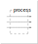

### Cut Primitive

```faust
diff(!)
```

$$
\langle u,u' \rangle = \langle \rangle
$$

- Input: one dual signal
- Output: None (no signals returned)

```faust
process = d.diff(!), _;
```


#### Add Primitive

```faust
diff(+)
```

$$
\langle u,u' \rangle + \langle v,v' \rangle = \langle u+v,u'+v' \rangle
$$

- Input: two dual signals
- Output: one dual signal consisting of the sum and `vars.N` partial derivatives

```faust
process = d.diff(+);
```

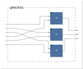

#### Subtract Primitive

```faust
diff(-)
```

$$
\langle u,u' \rangle - \langle v,v' \rangle = \langle u-v,u'-v' \rangle
$$

- Input: two dual signals
- Output: one dual signal consisting of the difference and `vars.N` partial
  derivatives

```faust
process = d.diff(-);
```


#### Multiply Primitive

```faust
diff(*)
```

$$
\langle u,u' \rangle \langle v,v' \rangle = \langle uv,u'v+v'u \rangle
$$

- Input: two dual signals
- Output: one dual signal consisting of the product and `vars.N` partial
  derivatives

```faust
process = d.diff(*);
```

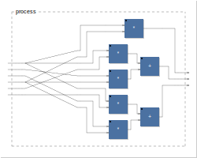

#### Divide Primitive

```faust
diff(/)
```

$$
\frac{\langle u,u' \rangle}{\langle v,v' \rangle} = \langle \frac{u}{v}, \frac{u'v - v'u}{v^2} \rangle
$$

- Input: two dual signals
- Output: one dual signal consisting of the quotient and `vars.N` partial
  derivatives

NB. To prevent division by zero in the partial derivatives, `diff(/)`
uses whichever is the largest of $v^2$ and $1\times10^{-10}$.

```faust
process = d.diff(/);
```


#### Power primitive

```faust
diff(^)
```

$$
\langle u,u' \rangle^{\langle v,v' \rangle} =
\langle u^v, u^{v-1}(vu' + uv'\ln(u)) \rangle
$$

- Input: two dual signals
- Output: one dual signal consisting of the first input signal raised to the
  power of the second, and `vars.N` partial derivatives.

```faust
process = d.diff(^);
```


#### `int` Primitive

```faust
diff(int)
```

$$
\text{int}\left(\langle u, u'\rangle\right) = \langle\text{int}(u), \partial \rangle, \quad
\partial = \begin{cases}
u', &\sin(\pi u) = 0, u~\text{increasing} \\
-u', &\sin(\pi u) = 0, u~\text{decreasing} \\
0, &\text{otherwise.}
\end{cases}
$$

- Input: one dual signal
- Output: one dual signal consisting of the integer cast and `vars.N` partial
  derivatives

NB. `int` is a discontinuous function, and its derivative is impulse-like at
integer values of $u$, i.e. at $\sin(\pi u) = 0$; impulses are positive for
increasing $u$, negative for decreasing.[^5]

[^5]: Yes, this is a bit of an abomination, mathematically-speaking.

```faust
process = d.diff(int);
```

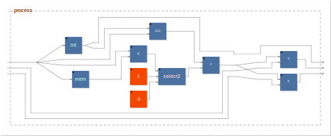

#### `mem` Primitive

```faust
diff(mem)
```

$$
\langle u, u'\rangle[n-1] = \langle u[n-1], u'[n-1] \rangle
$$

- Input: one dual signal
- Output: one dual signal consisting of the delayed signal and `vars.N` delayed
  partial derivatives

```faust
process = d.diff(mem);
```


#### `@` Primitive

```faust
diff(@)
```

$$
\langle u, u' \rangle[n-\langle v, v' \rangle] = \langle u[n-v], u'[n-v] - v'(u[n-v])'_n \rangle
$$

- Input: two dual signals
- Output: one dual signal consisting of the first input signal delayed by the
  second, and `vars.N` partial derivatives of the delay expression

NB. the general time-domain expression for the derivative of a delay features
a component which is a derivative with respect to (discrete) time:
$(u[n-v])'_n$.
This component is computed asymmetrically in time, so `diff(@)` is of
limited use for time-variant $v$.
It appears to behave well enough for fixed $v$.

```faust
process = d.input,d.diff(10) : d.diff(@);
```

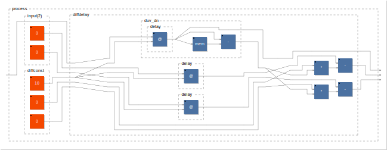

#### `sin` Primitive

```faust
diff(sin)
```

$$
\sin(\langle u, u'\rangle) = \langle\sin(u), u'\cos(u)\rangle
$$

- Input: one dual signal
- Output: one dual signal consisting of the sine of the input and `vars.N`
  partial derivatives

```faust
process = d.diff(sin);
```

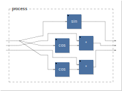

#### `cos` Primitive

```faust
diff(cos)
```

$$
\cos(\langle u, u'\rangle) = \langle\cos(u), -u'\sin(u)\rangle
$$

- Input: one dual signal
- Output: one dual signal consisting of the cosine of the input and `vars.N`
  partial derivatives

```faust
process = d.diff(cos);
```


#### `tan` Primitive

```faust
diff(tan)
```

$$
\tan(\langle u, u'\rangle) = \langle\tan(u), \frac{u'}{\cos^2(u)}\rangle
$$

- Input: one dual signal
- Output: one dual signal consisting of the tangent of the input and `vars.N`
  partial derivatives

NB. To prevent division by zero in the partial derivatives, `diff(tan,vars.N)`
uses whichever is the largest of $\cos^2(u)$ and $1\times10^{-10}$.

```faust
process = d.diff(tan);
```


#### `asin` Primitive

```faust
diff(asin)
```

$$
\arcsin(\langle u, u'\rangle) = \langle\arcsin(u), \frac{u'}{\sqrt{1-u^2}}\rangle
$$

- Input: one dual signal
- Output: one dual signal consisting of the arcsine of the input and `vars.N`
  partial derivatives

NB. To prevent division by zero in the partial derivatives, `diff(asin,vars.N)`
uses whichever is the largest of $\sqrt{1-u^2}$ and $1\times10^{-10}$.

```faust
process = d.diff(asin);
```


#### `acos` Primitive

```faust
diff(acos)
```

$$
\arccos(\langle u, u'\rangle) = \langle\arccos(u), -\frac{u'}{\sqrt{1-u^2}}\rangle
$$

- Input: one dual signal
- Output: one dual signal consisting of the arccosine of the input and `vars.N`
  partial derivatives

NB. To prevent division by zero in the partial derivatives, `diff(acos,vars.N)`
uses whichever is the largest of $\sqrt{1-u^2}$ and $1\times10^{-10}$.

```faust
process = d.diff(acos);
```


#### `atan` Primitive

```faust
diff(atan)
```

$$
\arctan(\langle u, u'\rangle) = \langle\arctan(u), \frac{u'}{\sqrt{1+u^2}}\rangle
$$

- Input: one dual signal
- Output: one dual signal consisting of the arctan of the input and `vars.N`
  partial derivatives

```faust
process = d.diff(atan);
```


#### `atan2` Primitive

```faust
diff(atan2)
```

$$
\arctan2(\langle u, u'\rangle, \langle v, v' \rangle) = \langle\arctan2(u, v), \frac{u'v+v'u}{\sqrt{u^2+v^2}}\rangle
$$

- Input: two dual signals
- Output: one dual signal consisting of the arctan2 of the input and `vars.N`
  partial derivatives

```faust
process = d.diff(atan2);
```


#### `exp` Primitive

```faust
diff(exp)
```

$$
\exp(\langle u, u'\rangle) = \langle\exp(u), u'*\exp(u)\rangle
$$

- Input: one dual signals
- Output: one dual signal consisting of the exp of the input and `vars.N`
  partial derivatives

```faust
process = d.diff(exp);
```


#### `log` Primitive

```faust
diff(log)
```

$$
\log(\langle u, u'\rangle) = \langle\log(u), \frac{u'}{u}\rangle
$$

- Input: one dual signals
- Output: one dual signal consisting of the log of the input and `vars.N`
  partial derivatives

```faust
process = d.diff(log);
```


#### `log10` Primitive

```faust
diff(log10)
```

$$
\log_{10}(\langle u, u'\rangle) = \langle\log_{10}(u), \frac{u'}{u\log_{10}(u)}\rangle
$$

- Input: one dual signals
- Output: one dual signal consisting of the $log_{10}$ of the input and `vars.N`
  partial derivatives

```faust
process = d.diff(log10);
```


#### `sqrt` Primitive

```faust
diff(sqrt)
```

$$
\sqrt(\langle u, u'\rangle) = \langle\sqrt(u), \frac{u'}{2*\sqrt(u)}\rangle
$$

- Input: one dual signals
- Output: one dual signal consisting of the sqrt of the input and `vars.N`
  partial derivatives

```faust
process = d.diff(sqrt);
```


#### `abs` Primitive

```faust
diff(abs)
```

$$
|(\langle u, u'\rangle)| = \langle|u|, u'*\frac{u}{|u|}\rangle
$$

- Input: one dual signals
- Output: one dual signal consisting of the abs of the input and `vars.N`
  partial derivatives

```faust
process = d.diff(abs);
```


#### `min` Primitive

```faust
diff(min)
```

$$
\min(\langle u, u' \rangle, \langle v, v' \rangle) = \left\langle \min(u, v), d \right\rangle \\
\text{where} \\
d =
\begin{cases}
u' & \text{if } u < v \\
v' & \text{if } u \geq v
\end{cases}
$$

- Input: two dual signals
- Output: one dual signal consisting of the min of the input and `vars.N`
  partial derivatives

```faust
process = d.diff(min);
```


#### `max` Primitive

```faust
diff(max)
```

$$
\max(\langle u, u' \rangle, \langle v, v' \rangle) = \left\langle \max(u, v), d \right\rangle \\
\text{where} \\
d =
\begin{cases}
u' & \text{if } u \geq v \\
v' & \text{if } u < v
\end{cases}
$$

- Input: two dual signals
- Output: one dual signal consisting of the max of the input and `vars.N`
  partial derivatives

```faust
process = d.diff(max);
```


#### `floor` Primitive

```faust
diff(floor)
```

$$
\lfloor(\langle u, u'\rangle)\rfloor = \langle\lfloor u \rfloor, u'\rangle
$$

- Input: one dual signals
- Output: one dual signal consisting of the floor of the input and `vars.N`
  partial derivatives

```faust
process = d.diff(floor);
```


#### `ceil` Primitive

```faust
diff(ceil)
```

$$
\lceil(\langle u, u'\rangle)\rceil = \langle\lceil u \rceil, u'\rangle
$$

- Input: one dual signals
- Output: one dual signal consisting of the floor of the input and `vars.N`
  partial derivatives

```faust
process = d.diff(ceil);
```


**Remainder of the primitives are defined as the following:**
$$
f(\langle u, u' \rangle) = \langle f(u), 0 \rangle
$$

This is due to the fact that these primitives (especially bitwise primitives and such) are not very defined in autodiff. These operators are naturally not defined in differentiation and hence its implementation will vary from case to case; as a result, this seems like the best solution to deal with the issue at the moment.

### Helper Functions

#### Input Primitive

```faust
input
```

$$
u \rightarrow \langle u,u' \rangle = \langle u,0 \rangle
$$

```faust
process = d.input;
```

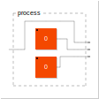

#### Differentiable Recursive Composition

```faust
rec(f~g,ngrads)
```

A utility for supporting the creation of differentiable recursive circuits.
Facilitates the passing of gradients into the body of the recursion.

- Inputs:
  - `f`: A differentiable expression taking two dual signals as input and
    producing one dual signal as output.
  - `g`: A differentiable expression taking one dual signal as input and
    producing one dual signal as output.
  - `ngrads`: The number of differentiable variables in `g`, i.e. the number
    of gradients to be passed into the body of the recursion.
- Outputs: One dual signal; the result of the recursion.

E.g. a differentiable 1-pole filter with one parameter, the coefficient of the
feedback component:

```faust
process = gradient,d.input : df.rec(f~g,1)
with {
    vars = df.vars((a)) with { a = -~_; };
    d = df.env(vars);
    f = d.diff(+);
    g = d.diff(_),vars.var(1) : d.diff(*);
    gradient = _;
};
```

#### Differentiable Phasor

```faust
phasor(f0)
```

#### Differentiable Oscillator

```faust
osc(f0)
```

#### Differentiable `sum` iteration
A utility function used to iterate `N` times through a summation of dual signals.

```faust
sumall(N)
```

#### ML Circuits
##### Backpropagation circuit
This backpropagation circuit is exclusively for _parameter estimation_ and it functions via the creation of gradients and a loss function in order to guide the `learnable` parameter to the `groundTruth`. The available loss functions can be found below.

```faust
backprop(groundTruth, learnable, lossFunction)
```

NB. this is defined _outside_ of the autodiff environment, e.g.:

```faust
df = library("diff.lib");
...
process = df.backprop(groundTruth, learnable, lossFunction);
```

##### Backpropagation circuit (for when you lack inputs)
```faust
backpropNoInput(groundTruth, learnable, lossFunction)
```

NB. this is defined _outside_ of the autodiff environment, e.g.:

```faust
df = library("diff.lib");
...
process = df.backpropNoInput(groundTruth, learnable, lossFunction);
```

##### Loss Functions

This loss function requires a windowSize that allows Faust to record the (ba.)slidingMean of the last `windowSize` inputs to the loss function. This allows the input to be averaged over a small period of time and avoid random spikes of inputs or inconsistencies in signals. This loss function also calculates the loss as well the gradients to guide the `learnable` parameter to the required `truth` parameter.

Furthermore, `optimizer` can be substituted with a scheduler as listed below. 

###### L1 time-domain (MAE)

```faust
learnMAE(windowSize, optimizer)
```

- Input: windowSize, optimizer
- Output: loss, a gradient per parameter defined in the environment

Mathematically, this loss function is defined as:
$$
L = |y - \hat{y}|
$$
while, gradients are defined in autodiff as:
$$
G = \frac{y - \hat{y}}{|y - \hat{y}|} \cdot \frac{\partial y}{\partial x}
$$
where $y$ is your learnable parameter, while $\hat{y}$ is your truth parameter.

###### L2 time-domain (MSE)

```faust
learnMSE(windowSize, optimizer)
```

- Input: windowSize, optimizer
- Output: loss, a gradient per parameter defined in the environment

Mathematically, this loss function is defined as:
$$
L = (y - \hat{y})^2
$$
while, gradients are defined in autodiff as:
$$
G = 2 \cdot (y - \hat{y}) \cdot \frac{\partial y}{\partial x}
$$
where $y$ is your learnable parameter, while $\hat{y}$ is your truth parameter.

###### MSLE time-domain

```faust
learnMSLE(windowSize, optimizer)
```

- Input: windowSize, optimizer
- Output: loss, a gradient per parameter defined in the environment

Mathematically, this loss function is defined as:
$$
L = (\log(y + 1) - \log(\hat{y} + 1))^2
$$
while, gradients are defined in autodiff as:
$$
G = 2 \cdot \frac{\log(y + 1) - \log(\hat{y} + 1)}{y + 1} \cdot \frac{\partial y}{\partial x}
$$
where $y$ is your learnable parameter, while $\hat{y}$ is your truth parameter.

###### Huber time-domain

```faust
learnHuber(windowSize, optimizer, delta)
```

- Input: windowSize, optimizer, delta
- Output: loss, a gradient per parameter defined in the environment

Mathematically, this loss function is defined as:
$$
L_\delta(y, \hat{y}) = 
\begin{cases} 
\frac{1}{2}(y - \hat{y})^2 & \text{for } |y - \hat{y}| \le \delta, \\ 
\delta \cdot \left(|y - \hat{y}| - \frac{1}{2}\delta\right) & \text{otherwise.}
\end{cases}
$$
while, gradients are defined in autodiff as:
$$
G_\delta(y, \hat{y}) = 
\begin{cases} 
(y - \hat{y})^2 * \frac{\partial y}{\partial x} & \text{for } |y - \hat{y}| \le \delta, \\ 
\delta \cdot \left(\frac{y - \hat{y}}{|y - \hat{y}|}\right) \cdot \frac{\partial y}{\partial x} & \text{otherwise.}
\end{cases}$$
where $y$ is your learnable parameter, while $\hat{y}$ is your truth parameter; a suggested $\delta$ is 1.0.

###### Linear frequency-domain
NB. This loss function converges to the global minima for the range $[140, 1350]$. A recurring issue one can notice is that the loss landscape is so varied that it fails to learn outside this range and gets stuck at local minimas. A possible solution to this issue is to introduce a better optimizer (rather than SGD), or a learning rate scheduler to solve such an issue. We report that RMSProp seems to break out of the minima at some threshold and it seems to train well until another minima. As a result, we suspect that the loss landscape is a series of plateaus and hence, a suitable learning rate scheduler (such as, an oscillating learning rate) and a good optimizer is required to solve this problem.

```faust
learnLinearFreq(windowSize, optimizer)
```

##### Learning Rate Scheduler
This scheduler decays the learnable rate by $exp(delta)$ every $epoch$ iterations.

Input: learning_rate, epoch, delta
Output: resulting learning_rate

```faust
learning_rate : learning_rate_scheduler(epoch, delta)
```

NB. We plan to implement other schedulers such as cosine decay and more.

##### Optimizers
Optimizers are algorithms or methods used in ML to adjust the learning rate / gradients of a model in order to minimize the loss function. 

###### Momentum-based optimizers
One can easily introduce the concept of momentum into their optimizer by simply modifying their variables in the diff environment to the following:

```faust
df = library("diff.lib");
vars = df.vars((x1,x2))
with {
    x1 = _ : +~(_ : *(momentum)) : -~_ <: attach(hbargraph("x1",0,1));
    x2 = _ : +~(_ : *(momentum)) : -~_<: attach(hbargraph("x2",0,1));
    momentum = 0.9;
};
```

We suggest the use of this only when using SGD as the optimizer.

###### SGD Optimizer
This is a regular stochastic gradient descent optimizer which does not account for an adaptive learning rate. This performs pure gradient descent.

```faust
optimizeSGD(learningRate)
```

###### Adam Optimizer
This is an optimizer, implemented as per the original Adam paper[^6].

```faust
optimizeAdam(learningRate, beta1, beta2)
```

We recommend beta1 and beta2 to be 0.9 and 0.999; similar to Kera's recommendations.

###### RMSProp Optimizer
This is an optimizer, implemented as per the original RMSProp presentation[^7].

```faust
optimizeRMSProp(learningRate, rho)
```
We recommend rho to be 0.9; similar to Kera's recommendations.

An implementation of any of the above optimizers can be seen below:

```faust
df.backprop(truth,learnable,d.learnMAE(1<<5,d.optimizeSGD(1e-3)))
```

[^6] https://arxiv.org/abs/1412.6980
[^7] https://www.cs.toronto.edu/~tijmen/csc321/slides/lecture_slides_lec6.pdf

## Neural Networks
The core concept of NNs is a neuron. We introduce the concept of a neuron in this library. Backpropagation is a difficult in a functional language, such as Faust. 

Since much of what we have covered deals with parameter estimation, we know that gradient descent is especially effective to do this task in DSP. The issue is the creation of a fully functioning ML model that can create accurate weights and biases to deal with tasks such as classification, regression and more. This can also be extended to more complex models such as the creation of generative models, such as autoencoders. 

### A functioning neuron
We introduce the concept of a single functioning neuron in example `.\examples\experiments\single_neuron.dsp`. This allows us to take a single hidden layer between the input and the output. This example serves to an classification example to illustrate how Faust deals with non-linearities and how quickly epoches occur in Faust.

As we know, the structure of a single neuron looks something like so: 


In Faust, this looks something like this, along with the backpropagation algorithm:


So, what exactly happens in a neuron? Say we use a sigmoid function as a non-linear activation function in this example.
The hidden layer calculates the following:
$$
a_{1} = w1 \cdot x1 + w2 \cdot x2 + w3 \cdot x3 \\

y = \sigma(a_{1})
$$

Mathematically, the backpropagation algorithm, even for a single neuron, is complex. This example utilizes the MAE / L1-norm loss function. The loss is represented as:
$$
L = |y - \hat{y}|
$$

This seems simple enough, but for defining the gradients, we need to define:
$$
G_{i} = \frac{\partial L}{\partial w_{i}}
$$
This needs to further simplified for our usage via chain rule:
$$
G_{i} = \frac{\partial L}{\partial w_{i}} = \frac{\partial L}{\partial y} \cdot \frac{\partial y}{\partial a_{1}} \cdot \frac{\partial a_{1}}{\partial w_{i}} \\
$$

$$
\frac{\partial L}{\partial y} = \frac{y - \hat{y}}{|y - \hat{y}|} \\
$$

$$
\frac{\partial y}{\partial a_{1}} = \frac{\partial (\sigma(a_{1}))}{\partial a_{1}} = \sigma(a_{1}) \cdot (1 - \sigma(a_{1})) \\
$$

$$ 
\frac{\partial a_{1}}{\partial w_{i}} = x_{i} \\
$$

This is pretty complex. Imagine the complexity for more deeper layers! You would have chains of chains of chains ... rules. As a result, there is a definite need for a generalization for such gradients.

NB. Faust's system of running epoches is very quick (it reaches 20000 epoches in about 10 seconds) and hence the chance of overfitting is very high in this example. 

## Roadmap
- A dataset creation / storage method...
- A more generalized method for calculating gradients for weights in neurons...
- Automatic parameter normalisation...
- Reverse mode autodiff...
- Batched training data/ground truth...
- Offline training &rightarrow; weights &rightarrow; real-time inference...
